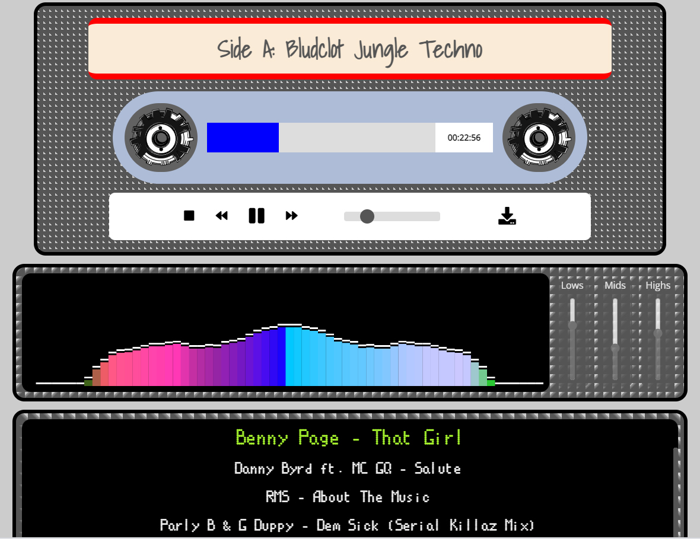

# 🖭 MixTape HeavyWeight 🥊

**MixTape HeavyWeight** is a feature-rich web app built for streaming and downloading DJ mixes. The intuitive user interface incorporates skeuomorphic design elements reminiscent of a hi-fi stacking system and classic old-school mixtapes. An array of features include an audio visualizer, a skippable playlist (allowing you to click through multiple tracks despite only loading a single audio file), and a comments section (which doesn't interrupt playback). As the mix plays, the tracklisting updates automatically, so the listener knows at a glance which song the DJ is spinning!

 

## ▶️ Getting Started 🚦

🏋 Try it for yourself: [MixTape HeavyWeight](https://mixtape-heavyweight.one/gf/noodles.php) 𝄞⨾𓍢ִ໋

💪🏾 Read the [Blog Post](https://medium.com/@followcrom/mixtape-heavyweight-259444d11ca9) 🤼

## 💫 Features

- Dynamic track title updates synchronized with audio playback
- Audio visualizer with color-coded bars represents the music
- Sliders to EQ the sound
- Post comments and star ratings using Fetch API
- Jump to a song by clicking on the playlist
- Skip forward and backward in the mix

## How To Use 🕹️

1. Clone the repository:
   `git clone https://github.com/followcrom/MixTapeHeavyWeight.git`

2. Link to your DJ mix audio files in the sections marked in the PHP.

3. Add the associated metadata, such as tracklists and timings, in the marked section in the PHP.

4. Make modifications to the CSS to achieve your desired visual appearance.

5. Edit the .js files to customize the functionality of the application to meet your requirements.

## 🤖 Technologies 🦾

- JavaScript for implementing the functionality
- Web Audio API for audio processing
- Canvas API for rendering the audio visualizer
- Fetch API for submitting comments and ratings without page reload
- HTML5 for structuring the content
- CSS3 for styling

## ✍🏻 Authors 🙋‍♂️

🌐 followCrom: [followCrom online](https://followcrom.com/index.html) 🌐

📫 followCrom: [get in touch](https://followcrom.com/contact/contact.php) 📫

## License 🎓

This project is open source and available under the MIT License.

